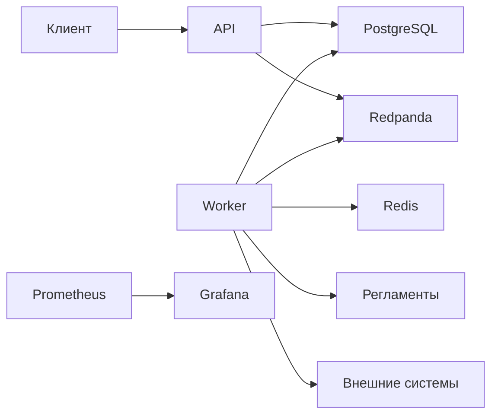
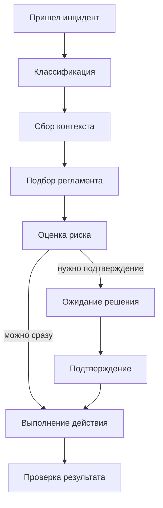

# Сервис операционного контроля маркетплейсов

Проект про обработку операционных инцидентов в продаже через маркетплейсы. Система принимает инцидент, поднимает нужный контекст, выбирает подходящий сценарий действий, при необходимости ждет подтверждение и сохраняет всю историю выполнения.

## Что умеет сервис

- принимать инциденты через API
- определять тип проблемы
- поднимать данные по заказам, остаткам, ценам и задачам синхронизации
- подбирать подходящий регламент
- предлагать следующее действие
- автоматически выполнять безопасные действия
- ставить рискованные действия на подтверждение
- сохранять шаги, события, повторы и итоговый результат

## Какие кейсы есть в демо

- зависший заказ после оплаты
- расхождение остатков
- резкое падение цены
- сбой синхронизации по таймауту

## Стек

- Python 3.12+
- FastAPI
- SQLAlchemy
- PostgreSQL
- Redis
- Redpanda
- LangGraph
- Prometheus
- Grafana
- pytest
- Ruff
- mypy

## Схема



## Как идет обработка



## Быстрый старт

```bash
docker compose up --build -d
make migrate-docker
make seed-docker
make demo-docker
```

Проверка:

```bash
curl http://localhost:8000/health
curl http://localhost:8000/ready
```

## Переменные окружения

Главные переменные:

- `DATABASE_URL`
- `REDIS_URL`
- `KAFKA_BOOTSTRAP_SERVERS`
- `KAFKA_TOPIC`
- `LLM_PROVIDER`
- `OPENAI_API_KEY`
- `OPENAI_BASE_URL`
- `OPENAI_MODEL`

По умолчанию сервис запускается в локальном режиме без внешнего платного API.

## Что лежит в тестовых данных

- заказы
- позиции заказов
- остатки
- история цен
- задачи синхронизации
- регламенты
- исторические инциденты

## Как работает подтверждение

Под подтверждение уходят действия, которые могут повлиять на внешний мир:

- сверка остатков
- изменение цены
- передача в другую команду

## Как работают повторы

Для временных ошибок синхронизации есть ограниченный повтор:

- с лимитом по числу попыток
- с записью каждой попытки в базу
- с видимостью через API и метрики

## Наблюдаемость

- API: `http://localhost:8000/metrics`
- Worker: `http://localhost:9100`
- Prometheus: `http://localhost:9090`
- Grafana: `http://localhost:3000`

## Полезные команды

```bash
make up
make migrate-docker
make seed-docker
make demo-docker
make logs
make lint
make typecheck
make test
```

## Структура проекта

```text
app/
  api/              HTTP слой
  application/      процесс обработки и бизнес-логика
  domain/           схемы и перечисления
  infrastructure/   БД, Redis, Kafka, провайдеры, инструменты
  workers/          фоновые процессы
docs/               документация
seed/               тестовые данные
examples/           примеры инцидентов
tests/              тесты
```

## Открытая документация

- [`docs/architecture.md`](./docs/architecture.md)
- [`docs/workflows.md`](./docs/workflows.md)
- [`docs/api.md`](./docs/api.md)
- [`docs/operations.md`](./docs/operations.md)
