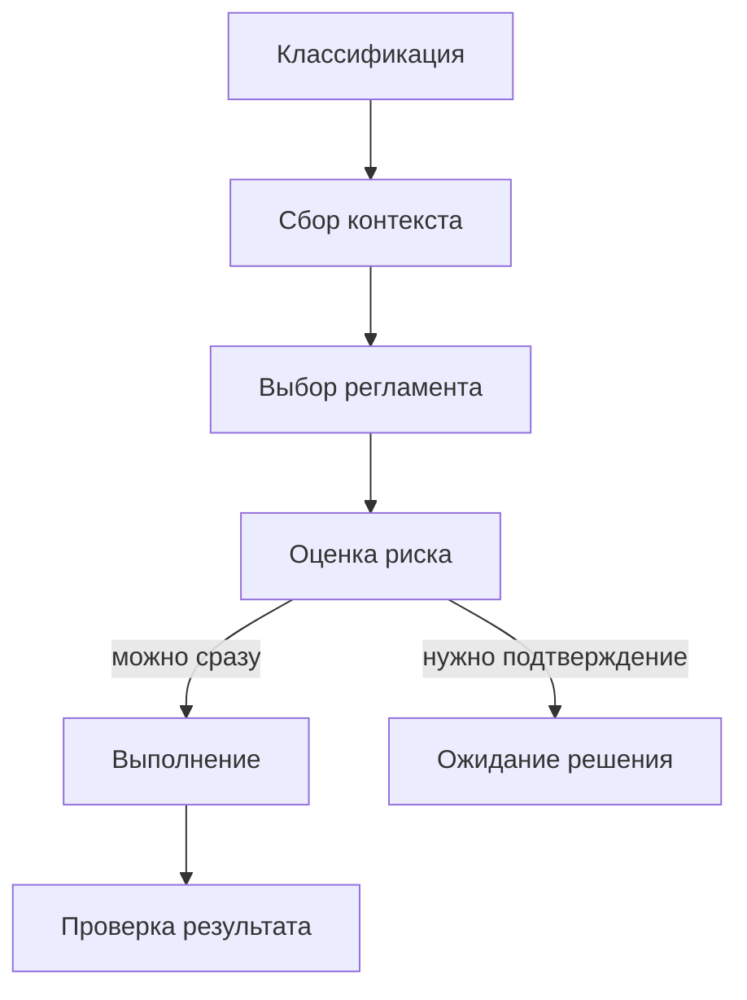
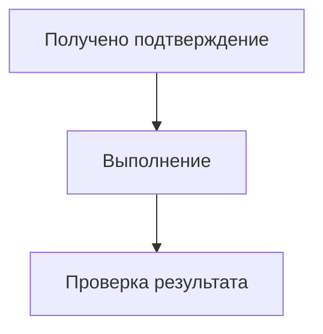
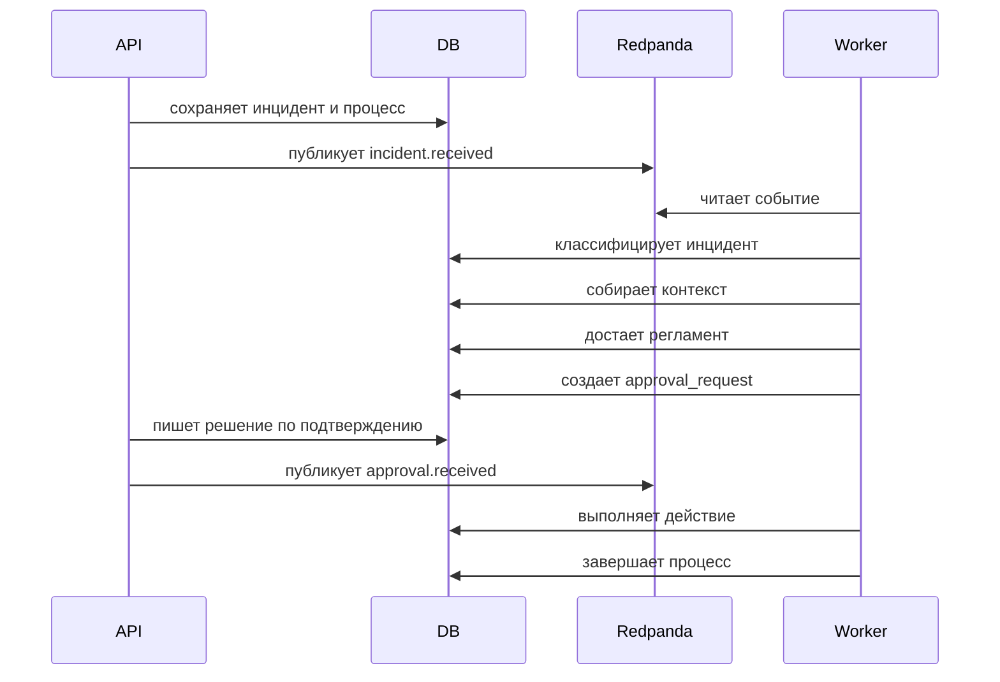

# Процесс обработки

Worker гоняет процесс через LangGraph. Он разбит на понятные шаги, поэтому легко понять, что именно происходило и где все остановилось.

## Шаги

### 1. Классификация

Система определяет тип инцидента и его важность.

### 2. Сбор контекста

Поднимаются данные по:

- заказу
- остаткам
- ценам
- задаче синхронизации

### 3. Выбор регламента

Сервис ищет подходящий документ в базе знаний и выбирает сценарий дальнейших действий.

### 4. Оценка риска

Если действие безопасное, оно выполняется сразу. Если нет, создается запись на подтверждение.

### 5. Выполнение

На этом шаге уже запускаются инструменты:

- повтор синхронизации
- запрос на сверку
- запрос на изменение цены
- создание тикета

### 6. Проверка результата

В конце записывается итог и финальный статус.

## Основной путь

## Возобновление после подтверждения

## Пример на кейсе с остатками

## Повторные попытки

Для временных ошибок синхронизации есть ограниченный повтор:

- максимум 3 попытки
- между ними фиксированная пауза
- повтор идет только на временные ошибки
- каждая попытка сохраняется в базу

Это часть операционной истории, а не просто внутренняя техническая деталь.
